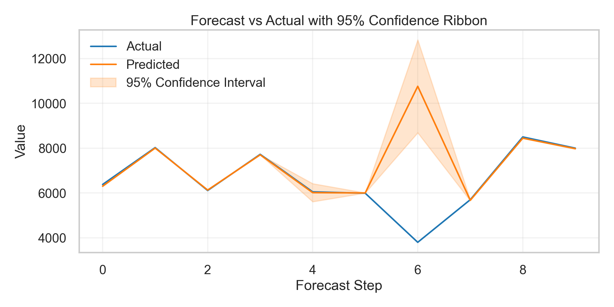
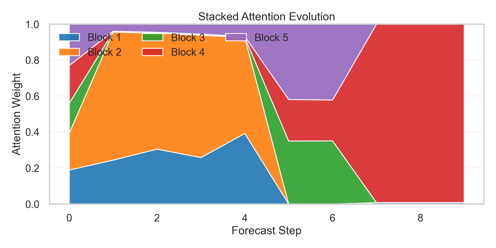
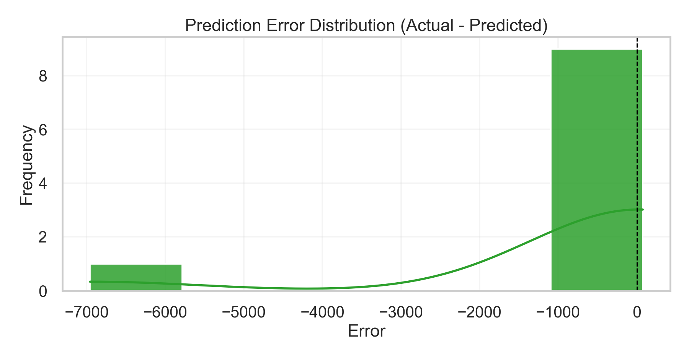

# Adaptive Attention-based SResdRVFL for Time-Series Forecasting

This project implements an adaptive stacked residual Deep RVFL model for univariate time-series forecasting with:

- Multi-resolution decomposition (trend/seasonal/residual)
- Adaptive residual scaling (`s`)
- Attention-based block aggregation
- 95% uncertainty interval
- Online update via Recursive Least Squares (RLS)
- Visualization of predictions, attention evolution, and error distribution

## Files

- `adaptive_sresdrvfl.py`: main model + interactive CLI
- `visualize_results.py`: visualization script for `results.csv`
- `aemo_qld1_2022_01.csv`: sample AEMO QLD dataset
- `results.csv`: generated logging output during interactive runs

## Setup

Install dependencies:

```bash
pip install numpy pandas scikit-learn matplotlib seaborn statsmodels
```

## Run Forecasting (Interactive)

```bash
python adaptive_sresdrvfl.py --csv-path ".\aemo_qld1_2022_01.csv" --region QLD --window-size 50
```

Interactive flow:

1. Enter 50 comma-separated historical values.
2. Review forecast report (point forecast, CI, attention, learned scaling factor).
3. Enter actual next value to update online (or press Enter to skip).

`results.csv` is saved every 10 successful updates and on exit.

## Sample Input and Output

Sample user input (50 values):

```text
5982.8, 6019.8, 5982.6, 5915.7, 5885.3, 5898.4, 5825.9, 5908.8, 5842.1, 5844.0, 5840.5, 5810.0, 5838.5, 5786.1, 5821.4, 5754.2, 5744.1, 5722.5, 5710.2, 5733.9, 5742.8, 5711.0, 5725.6, 5688.1, 5645.3, 5632.1, 5605.5, 5612.4, 5589.9, 5620.3, 5595.7, 5610.1, 5575.4, 5582.9, 5590.2, 5612.8, 5645.0, 5678.2, 5710.5, 5745.2, 5790.1, 5822.4, 5855.9, 5910.3, 5955.8, 6012.1, 6088.4, 6155.2, 6220.7, 6305.4
```

Sample forecast report:

```text
=== Forecast Report ===
Input Summary      : Last 50 steps received
Decomposition      : Trend: Rising / Seasonal: High / Residual: High Noise
Point Forecast     : 6304.5902
95% Confidence     : [6284.2098, 6324.9707]
Attention Weights  : Block 1: 0.1890, Block 2: 0.2059, Block 3: 0.1658, Block 4: 0.2098, Block 5: 0.2295
Learned Scaling s  : Mean 0.5243 (Block 1: 0.5278, Block 2: 0.5286, Block 3: 0.5256, Block 4: 0.5169, Block 5: 0.5226)
Update status      : Online RLS update applied.
Updated Attention  : Block 1: 0.2443, Block 2: 0.7121, Block 3: 0.0010, Block 4: 0.0033, Block 5: 0.0393
```

Another sample where the model strongly re-weights experts after a difficult pattern:

```text
Attention Weights  : Block 1: 0.3925, Block 2: 0.5327, Block 3: 0.0018, Block 4: 0.0050, Block 5: 0.0679
Point Forecast     : 6015.1798
95% Confidence     : [5611.9847, 6418.3749]
Update status      : Online RLS update applied.
Updated Attention  : Block 1: 0.0000, Block 2: 0.0000, Block 3: 0.3505, Block 4: 0.2311, Block 5: 0.4184
```

Periodic logging confirmation:

```text
Results saved      : results.csv (10 rows, periodic flush)
```

## Visualize Results

```bash
python visualize_results.py --input results.csv --output-dir plots --show
```

Generated plots:

- `plots/forecast_vs_actual_ci.png`
- `plots/attention_evolution.png`
- `plots/error_distribution.png`

## Result Graphs

### Forecast vs Actual with Confidence Ribbon



### Stacked Attention Evolution



### Error Distribution



## `results.csv` Columns

- `Actual`
- `Predicted`
- `Lower_Bound`
- `Upper_Bound`
- `Block1_Attn`
- `Block2_Attn`
- `Block3_Attn`
- `Block4_Attn`
- `Block5_Attn`
